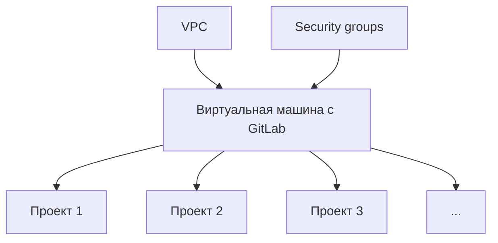

Зачастую мы слышим о terraform в контексте управления облачной инфраструктурой. История классическая. Сначала кажется, что проще в UI накликать инфраструктуру, никакой код не нужен. Но выясняется, что по мере разрастания проекта ситуация меняется. Например, есть необходимость поднять дополнительные 20 виртуальных машин с определенной конфигурацией. В ui облака практически неизбежно придется прокликивать создание каждой, а через код достаточно написать 5-10 строчек. Все это хорошо известно, но зачем применять iac подход к репозиториям? Кажется, что git-репозитории - это совсем не инфраструктура.

## Зачем управлять репозиториями через terraform?

### 1. Упрощенное дублирование

Представим ситуацию, команда разработка приступает к созданию нового микросервиса. Ей необходим репозиторий с такими же настройками, как в остальных их проектах. С iac подходом не придется ходить в старые репозитории и смотреть как там было настроено. Достаточно будет дописать пару строчек кода и применить их. Отмечу, что, например, в Gitlab есть возможность наследовать настройки от родительской группы. Но далеко не всегда репозитории создаются в одних группах из-за особенностей корпоративных процессов. Кроме того, не все настройки можно унаследовать.

### 2. Единый подход к управлению

Хотя и формально репозиторий - это не инфраструктура, было бы приятно иметь единый интерфейс для описания всех конфигураций. Возьмем упрощенный пример. Нужно развернуть вм c gitlab


Через Terraform можно описать сеть и security группы. Через него же можно развернуть вм, описав в cloud-init установку Gitlab. И вот когда уже все подготовлено, можно через все тот же Terraform описать репозитории (кстати и не только их). На большом количестве различных конфигураций иметь единый интерфейс для их описания невероятно удобно.

## Управляем репозиториями в коде на примере Gitlab

### Пререквизиты

Давайте посмотрим на практике, как выглядит создание репозиториев в gitlab в коде. Для того, чтобы воспроизвести пример у себя, понадобится:
1. Аккаунт в [Gitlab](https://gitlab.com/users/sign_up) с [access токеном](https://docs.gitlab.com/user/profile/personal_access_tokens/#create-a-personal-access-token).
2. Установленный [Opentofu](https://opentofu.org/docs/intro/install/) (форк Terraform). Используем форк, т.к. в его лицензии нет существенных ограничений.

### Запуск уже готового манифеста
Если не хочется писать манифест самому, то можно просто скачать готовый и применить его
1. Сохраните себе [репозиторий](https://github.com/riftonix/terraform-shared/tree/gitlab-project/1.0.1) с terraform модулями
2. Перейдите в modules/gitlab-project/examples/multiple-projects
3. Вставьте ваш gitlab access token на 11-ой строчке
```hcl
token    = "<YOUR_GITLAB_TOKEN>"
```
4. Выполните
```sh
tofu init
tofu apply -auto-approve
```

### Создание манифеста с нуля
Весь код будем делать в файлике main.tf. Создайте его в пустой директории. Для начала добавим информацию о провайдере, с помощью которого будем вносить изменения. Не забудьте добавить ваш gitlab access token в 11-ую строчку.
```hcl
terraform {
  required_providers {
    gitlab = {
      source  = "gitlabhq/gitlab"
      version = "18.4.1"
    }
  }
}

provider "gitlab" {
  token    = "<YOUR_GITLAB_TOKEN>"   # Подставьте сюда ваш gitlab access token
  base_url = "https://gitlab.com/api/v4/"
}
```

Создадим репозитории. Для упрощения будет пример, когда настройки полностью совпадают за исключением имен проектов. В реальных задачах конечно же так просто не будет. Здесь надо понимать, что есть 2 пути.
1. Конфигурация хранится в большом словаре и репозитории описываются в цикле по верхнеуровневым ключам этого словаря
2. Описание по-просту дублируются, общая конфигурация выносится в переменные.
Пока что рассмотрим простой пример
```hcl
module "riftonix_project_test" {
  source = "git::https://github.com/riftonix/terraform-shared.git//modules/gitlab-project?ref=gitlab-project/1.0.1"

  for_each = toset(["ms-1", "ms-2", "ms-3", "ms-4"])

  project_name                          = each.value                          # Имя проекта
  group_id                              = 0                                   # Проекты лежат в корневой группе, которая есть по умолчанию
  only_allow_merge_if_pipeline_succeeds = true                                # Мерж в protected ветки разрешаем, если пайплайн успешен
  protected_branches                    = ["main", "master", "release/*"]     # Описываем, какие ветки protected
}
```

Теперь инициализируем и применяем настройки
```sh
tofu init
tofu apply -auto-approve
```

## Выводы
Terraform можно использовать не только для управления инфраструктурой, а более глобально, упрявляя всеми сущностями, у которых есть web api. Здесь мы рассмотрели Gitlab проекты. При применении манифеста main.tf можно было заметить, что создалось 20 сущностей, хотя мы сделали всего лишь 4 репозитория. Такой подход описания конфигураций в коде возможно распространить и на другие компоненты. Это и управление grafana дашбордами, и различные git хостинги, и произвольные k8s манифесты (примеры реализации можно посмотреть [здесь](https://github.com/riftonix/terraform-shared/tree/master/modules)). Devops инженер должен владеть довольно обширным набором инструментов и очень круто, когда есть единый интерфейс для всех.